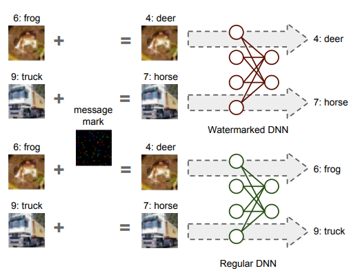

# model-watermarking
The repository provides an implementation of 8 backdoor-based watermarking [approaches](wm_methods.md) for neural networks and 2 [attacks](attacks.md) that aim to remove these watermarks. On this webpage, you can also find some already pretrained [models](models_main.md) (watermarked, non-watermarked, attacked) that you can use for your experiments.

## What is backdoor-based watermarking?
Backdoor-based Model Watermarking is a black-box type of watermarking DNNs. 

The idea is based on backdooring, i.e. the model is trained on additional falsely classified so-called trigger images. 

An image below demonstrates one of the scenarious how watermarks can be embedded into a deep neural network
([Guo and Potkonjak "Watermarking deep neural networks for embedded systems" (2018)](https://dl.acm.org/doi/10.1145/3240765.3240862)).

